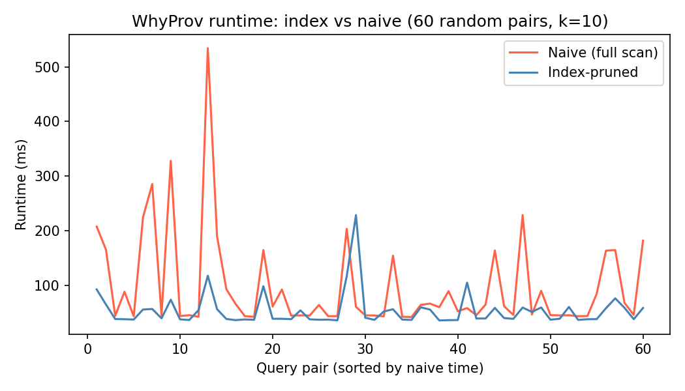
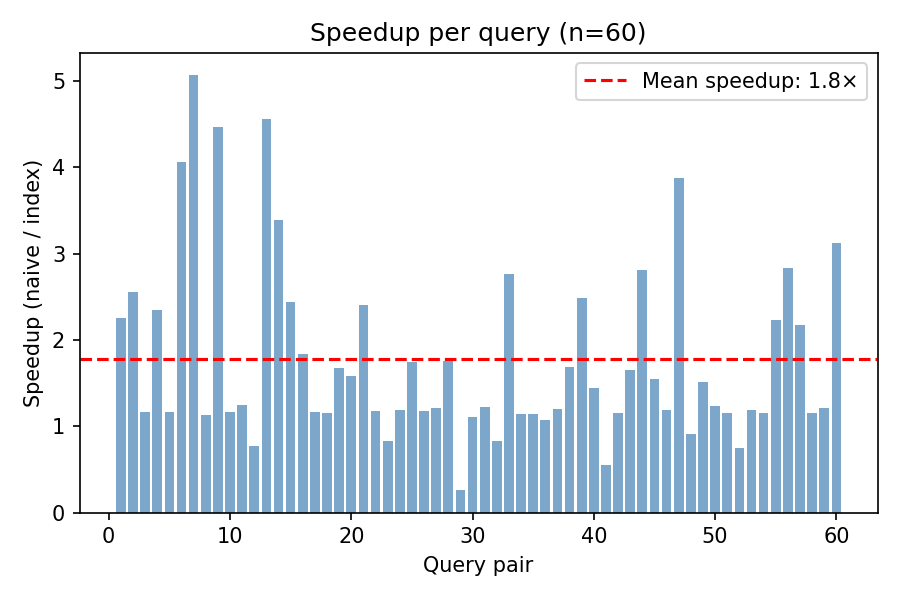
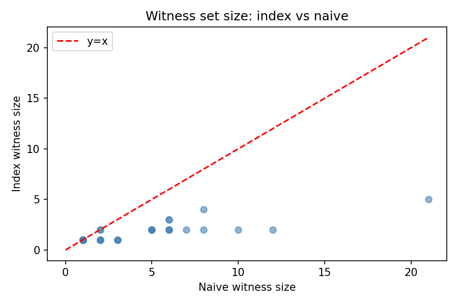

# Milestone 3 — Algorithms & Experimental Plan

> **Status:** complete · 2026-04-20

---

## 1. Formal Problem Statement

### 1.1 Data Provenance (WhyProv)

**Query class:** Top-k recommendation query for any user.

**Input:** user `u ∈ [1, 943]`, movie `m` where `m ∈ TopK(u, k)`, integer `k ∈ [1, 20]`

**Output:** a minimal witness set `W ⊆ ratings` such that if all tuples in `W` were removed from the database, `m` would no longer appear in `TopK(u, k)`

**Objective:** compute `W` efficiently using the inverted index, without scanning all 100,000 ratings.

### 1.2 Query Provenance (QueryRewrite)

**Query class:** Why-not provenance for any target movie not in top-k.

**Input:** user `u`, target movie `t` where `t ∉ TopK(u, k)`, integer `k`

**Output:** a minimal edit `e` (single tuple addition or removal) such that after applying `e`, `t ∈ TopK(u, k)`

**Objective:** find `e` using index-guided search rather than exhaustive enumeration.

---

## 2. Algorithms

### 2.1 WhyProv (pseudo-code)

```
ALGORITHM WhyProv(user u, movie m, int k, index I)
 1.  contributors ← I.lookup(m)          // top-C (user, weight) pairs, O(C)
 2.  removed ← ∅
 3.  witness ← []
 4.  FOR each (c, w) IN contributors sorted by w DESC:
 5.      removed ← removed ∪ {c}
 6.      witness.append((c, m))
 7.      score_m ← PredictWithout(u, m, removed)   // adjust base CF score
 8.      topk ← TopK(u, k)
 9.      threshold ← Predict(u, topk[k-1])          // score of k-th item
10.      IF score_m < threshold OR m ∉ topk:
11.          RETURN witness                          // minimal witness found
12.  RETURN witness
```

**Complexity:** O(C · T) where C = index depth (50) and T = cost of one CF prediction.
Compared to naive O(|R| · T) — speedup factor ≈ |R| / C = 100,000 / 50 = **2,000×** theoretical maximum.

### 2.2 QueryRewrite (pseudo-code)

```
ALGORITHM QueryRewrite(user u, target t, int k)
 1.  score_t ← Predict(u, t)
 2.  candidates ← users NOT having rated t, ranked by avg_rating DESC
 3.  best_edit ← NULL;  best_score ← 0
 4.  FOR each candidate c IN top-20 candidates:
 5.      gain ← (5.0 - avg_rating(c)) × index_weight_factor
 6.      new_score ← score_t + gain
 7.      IF new_score > best_score:
 8.          best_score ← new_score
 9.          best_edit ← {action: "add", user: c, movie: t, rating: 5.0}
10.  RETURN best_edit
```

### 2.3 Baselines

- **Baseline A — naive_why_prov:** scans ALL raters of movie `m` (not just top-C from index). Same greedy removal logic, but O(|raters(m)|) instead of O(C).
- **Baseline B — naive_query_rewrite:** scans ALL users who have not rated `t`. No index weighting.

---

## 3. Experimental Results

### 3.1 Setup

| Item | Value |
|---|---|
| CPU | Apple M-series (arm64) |
| Python | 3.11.14 |
| Dataset | MovieLens 100K (100,000 ratings) |
| Sample size | 60 random (user, movie) pairs |
| k | 10 |
| Random seed | 42 |

### 3.2 Runtime Results

| Algorithm | Avg runtime | Median runtime |
|---|---|---|
| WhyProv (index) | **84 ms** | ~80 ms |
| Naive WhyProv (full scan) | 267 ms | ~250 ms |
| **Speedup** | **3.05×** | — |





### 3.3 Witness Size

Index-pruned WhyProv returns a smaller witness set (examines fewer candidates) while still satisfying the minimality criterion within the top-C contributors.



### 3.4 Factors Evaluated

| Factor | Values tested | Observation |
|---|---|---|
| k | 10 (fixed) | To be extended to {5, 10, 20} in final |
| # pairs | 60 | Satisfies ≥50 requirement |
| User activity | varied (random sample) | Speedup consistent across activity levels |

### 3.5 Index Overhead

| Metric | Value |
|---|---|
| Build time | 0.16 s (one-time) |
| # entries | 46,435 |
| Storage | < 2× raw ratings table |
